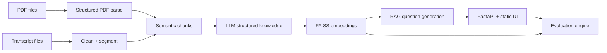

# Reverse KT Assessment System — Architecture

## Purpose

End-to-end reverse knowledge-transfer assessment: ingest **PDF playbooks** plus **Microsoft Teams transcript text** (VTT/TXT/DOCX), extract structured knowledge, index with **FAISS + OpenAI embeddings**, generate **exactly 25** RAG-grounded questions (10 MCQ / 8 subjective / 7 practical), and evaluate answers with **rules + LLM rubrics**.

## High-level flow



## Modules (code map)

| Layer | Location | Responsibility |
|------|----------|----------------|
| Ingestion | `app/services/ingestion/pdf_parser.py` | PyMuPDF blocks, headings, lists, `find_tables()` |
| Ingestion | `app/services/ingestion/transcript_ingest.py` | VTT/TXT/DOCX read, filler stripping, heuristic segmentation |
| Processing | `app/services/processing/text_clean.py` | Whitespace / noise normalization |
| Processing | `app/services/processing/chunking.py` | PDF block-aware + transcript segment chunking |
| Knowledge | `app/services/knowledge/extractor.py` | Mandatory JSON knowledge graph (LLM) |
| RAG | `app/services/rag/faiss_store.py` | Embeddings, cosine IP index, mixed PDF/transcript retrieval |
| AI | `app/services/ai/llm.py` | OpenAI / Azure OpenAI chat + embeddings |
| AI | `app/services/ai/prompts.py` | Versioned prompt templates |
| Questions | `app/services/questions/generator.py` | 25-question bank w/ private keys |
| Evaluation | `app/services/evaluation/engine.py` | MCQ deterministic + LLM scoring |
| Session | `app/services/session_store.py` | Filesystem session bundle + status machine |
| API | `app/api/v1/endpoints/*.py` | REST contract aligned to `frontend/js/app.js` |

## REST API (`/api/v1`)

- `POST /upload` — multipart upload; persists under `DATA_DIR/sessions/{id}/input`; requires **≥1 PDF** and **≥1 transcript-side file**.
- `GET /upload/{id}/status` — `{ pending | processing | extracting_knowledge | building_index | completed | failed }`.
- `GET /upload/{id}/knowledge` — structured units + aggregates for UI review.
- `POST /upload/{id}/reprocess` — rerun pipeline from stored inputs.
- `POST /assessment/{id}/generate` — builds 25 questions using RAG context bundle.
- `GET /assessment/{id}/questions` — learner-safe payload (no correct answers).
- `POST /assessment/{id}/evaluate` — scoring + narrative feedback JSON.

## RAG guarantees

1. Every chunk stores `source ∈ {pdf, transcript}` metadata.
2. `search_mixed` biases retrieval toward **both** sources before expansion.
3. Question prompt embeds concatenated retrieved chunk text with IDs; model must cite `context_chunk_ids_used` for traceability.

## Structured knowledge schema (canonical)

Each knowledge unit conforms to:

```json
{
  "topic": "",
  "source_type": "pdf|transcript",
  "concepts": [],
  "steps": [],
  "tools": [],
  "decisions": [],
  "common_issues": [],
  "key_insights": []
}
```

## Prompt strategy

- **Transcript structuring** pass isolates topics, exchanges, troubleshooting, decisions (reduces hallucination downstream).
- **Map-reduce knowledge** merges PDF excerpts + structuring JSON + transcript excerpt in one JSON response.
- **Question batching** passes large `rag_blob` + `knowledge_digest` so items stay specific to organizational context.
- **Evaluation** uses retrieval snippets + reference keyed answers; practical items score *process fidelity*.

## Storage & persistence

Default: local `DATA_DIR/sessions/{session_id}` with JSON + FAISS artifacts. Swap to S3/Azure Blob by replacing `session_store` with an object-backed implementation (same interface).

## Observability / production TODOs

- AuthN/Z + per-tenant namespaces.
- Async workers (Redis queue) for large PDFs.
- Encrypted disks for session directories.
- Rate limits on LLM endpoints.
- Export reports (PDF/HTML) & analytics dashboard.

## Local run

```bash
cd backend
python -m venv .venv
source .venv/bin/activate  # Windows: .venv\\Scripts\\activate
pip install -r requirements.txt
copy .env.example .env   # add OPENAI_API_KEY
uvicorn app.main:app --reload --host 0.0.0.0 --port 8000
```

Always run uvicorn **from `backend/`** so `import app` resolves. If you start it from the repo root, you’ll get `ModuleNotFoundError: No module named 'app'`. From the repo root you can instead use:

```bash
uvicorn app.main:app --reload --host 0.0.0.0 --port 8000 --app-dir backend
```

Docker:

```bash
export OPENAI_API_KEY=sk-...   # PowerShell: $env:OPENAI_API_KEY=\"...\"
docker compose up --build
```

Browse `http://127.0.0.1:8000/` (FastAPI mounts the static frontend when present).

## Validation samples

See `samples/sample_teams_transcript.txt` and `samples/sample_kt_playbook.pdf` (generated via `samples/generate_sample_pdf.py`). Upload **both** to exercise the pipeline.

### Latest automated test signal

```text
pytest -q (Python 3.13 venv on Windows host)
4 passed
```

Use **Python ≥3.11 with prebuilt NumPy wheels** (or Docker `python:3.11`) to avoid MSVC build requirements on Windows.
